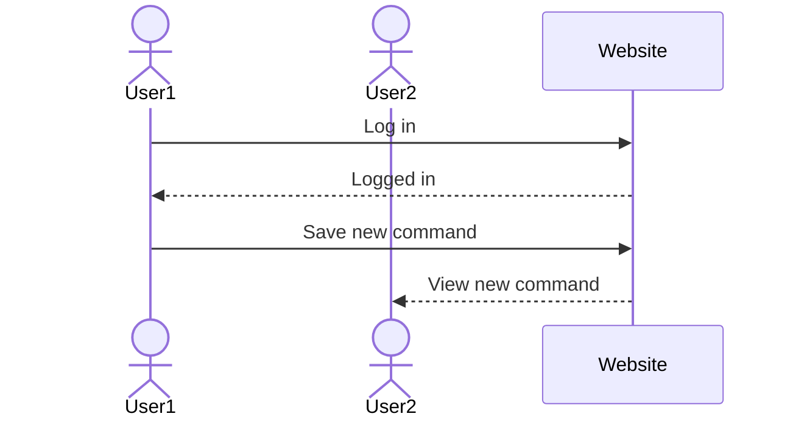

# FFmpeg Helper

[My Notes](notes.md)

FFmpeg Helper is a web application to interactively generate FFmpeg commands with an intuitive UI, save generated commands, and see commands others have generated.

> [!NOTE]
>  If you are not familiar with Markdown then you should review the [documentation](https://docs.github.com/en/get-started/writing-on-github/getting-started-with-writing-and-formatting-on-github/basic-writing-and-formatting-syntax) before continuing.

## 🚀 Specification Deliverable

> [!NOTE]
>  Fill in this sections as the submission artifact for this deliverable. You can refer to this [example](https://github.com/webprogramming260/startup-example/blob/main/README.md) for inspiration.

For this deliverable I did the following. I checked the box `[x]` and added a description for things I completed.

- [x] Proper use of Markdown
- [x] A concise and compelling elevator pitch
- [x] Description of key features
- [x] Description of how you will use each technology
- [x] One or more rough sketches of your application. Images must be embedded in this file using Markdown image references.

### Elevator pitch

FFmpeg is an incredibly powerful command-line tool for manipulating and editing media that can run on almost any platform. Unfortunately, with all this functionality and flexibilty comes a great pile of command-line options, manuals, and documentation for users to sift through. FFmpeg Helper provides a convenient UI to easily generate FFmpeg commands. Users can then save these commands for later and see what commands others have made.

### Design

### Key features

- Simple UI to select FFmpeg options
- Expose FFmpeg functionality for image, audio, and video transcoding
- Button to conveniently copy FFmpeg command to clipboard
- Allow selection of containers, codecs, and quality
- Allow saving useful commands to the user's account
- Allow browsing commands others have made
- Allow saving others' posts and seeing how many times each post has been saved
- Show updates to FFmpeg codebase

### Technologies

I am going to use the required technologies in the following ways.

- **HTML** - Site layout and structure: main page, profile page, and community page, with apropriate links between them
- **CSS** - Simple, responsive, and easy-to-read UI; generated FFmpeg command displayed in terminal-style section
- **React** - Interactivity, e.g. for login, command generation, and viewing of saved commands
- **Service** - Service backend supporting login, saving generated commands, saving community commands, and viewing codebase updates (3rd party)
- **DB/Login** - Save users and their login info, as well as their saved commands, save how many times each command has been saved
- **WebSocket** - Show in real time new commands that have been saved and updates to how many times

## 🚀 AWS deliverable

For this deliverable I did the following. I checked the box `[x]` and added a description for things I completed.

- [x] **Server deployed and accessible with custom domain name** - [My server link](https://ffmpeghelper.click).

## 🚀 HTML deliverable

For this deliverable I did the following. I checked the box `[x]` and added a description for things I completed.

- [x] **HTML pages** - HTML pages for home (command generation), community command, saved commands, and login
- [x] **Proper HTML element usage** - Semantic header, footer, and body; many HTML input elements; code blocks; etc.
- [x] **Links** - Links to each page in navbar in header, links to source and FFmpeg in footer
- [x] **Text** - Command descriptions on community and saved pages
- [x] **3rd party API placeholder** - Placeholders for GitHub badges in footer
- [x] **Images** - Site logo and favicon on all pages
- [x] **Login placeholder** - Login page log in and sign up options
- [x] **DB data placeholder** - Account and command storage on login and saved pages
- [x] **WebSocket placeholder** - Real-time display of new commands on community page

## 🚀 CSS deliverable

For this deliverable I did the following. I checked the box `[x]` and added a description for things I completed.

- [x] **Header, footer, and main content body** - Header, footer, and main content on all pages
- [x] **Navigation elements** - Navigation bar on header with links to each page
- [x] **Responsive to window resizing** - Header and footer change to two lines on mobile; grid of cards adapts to device display
- [x] **Application elements** - Understandable and well-styled application elements
- [x] **Application text content** - Readable text, consistent fonts, themed command-line text
- [x] **Application images** - Logo in navbar, logo in background on login page

## 🚀 React part 1: Routing deliverable

For this deliverable I did the following. I checked the box `[x]` and added a description for things I completed.

- [x] **Bundled using Vite** - Yes
- [x] **Components** - Yes; Home, Community, Saved, and Login components
- [x] **Router** - Yes, Router switches between each page as a single-page web app

## 🚀 React part 2: Reactivity

For this deliverable I did the following. I checked the box `[x]` and added a description for things I completed.

- [x] **All functionality implemented or mocked out** - Added login, saving and generating commands, and realtime generation of false commands
- [x] **Hooks** - Use of useState and useEffect hooks to implement reactivity and respond to component lifecycle events

## 🚀 Service deliverable

For this deliverable I did the following. I checked the box `[x]` and added a description for things I completed.

- [x] **Node.js/Express HTTP service** - Node.js server in service/index.js handles static files and APIs
- [x] **Static middleware for frontend** - Express middleware serves build react files
- [x] **Calls to third party endpoints** - Footer contains badges from shields.io (src/app.tsx), site generates custom QR codes via qrserver.com (src/qrcode/qrcode.tsx)
- [x] **Backend service endpoints** - Node.js server contains API endpoints accepting several HTTP methods
- [x] **Frontend calls service endpoints** - Frontend uses API endpoints for registration/login and getting/saving commands (src/api/api.ts)
- [x] **Supports registration, login, logout, and restricted endpoint** - Users can log in and can only save commands when logged in

## 🚀 DB/Login deliverable

For this deliverable I did the following. I checked the box `[x]` and added a description for things I completed.

- [ ] **Stores data in MongoDB** - I did not complete this part of the deliverable.
- [ ] **Stores credentials in MongoDB** - I did not complete this part of the deliverable.

## 🚀 WebSocket deliverable

For this deliverable I did the following. I checked the box `[x]` and added a description for things I completed.

- [ ] **Backend listens for WebSocket connection** - I did not complete this part of the deliverable.
- [ ] **Frontend makes WebSocket connection** - I did not complete this part of the deliverable.
- [ ] **Data sent over WebSocket connection** - I did not complete this part of the deliverable.
- [ ] **WebSocket data displayed** - I did not complete this part of the deliverable.
- [ ] **Application is fully functional** - I did not complete this part of the deliverable.
